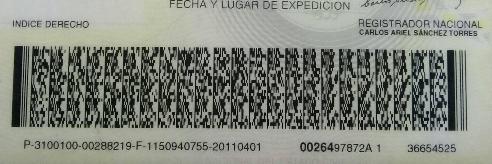
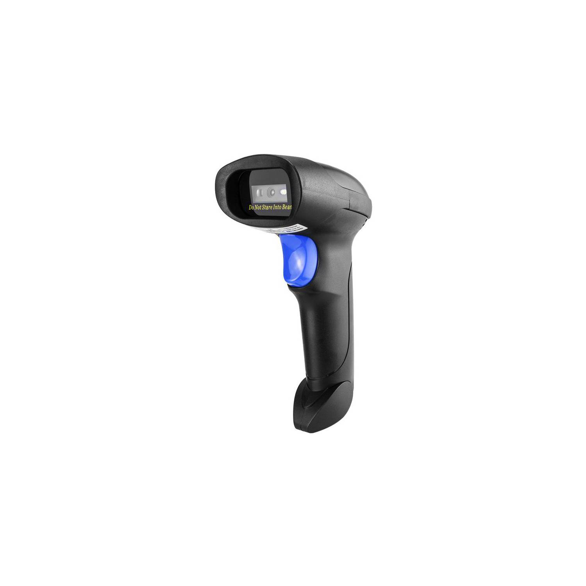
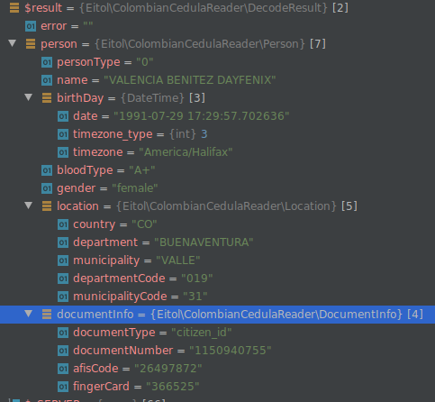

### Lector de cédulas colombianas

Contiene tres componentes:

1- src/pdf417_file_image_reader.py: Permite leer desde el pdf417 de la cédula colombiada desde una imagen y arrojar el
resultado parseado en consola

2- src/serial_bar_code_scanner_reader.py: Permite leer el código pdf417 desde un lector manual via USB

3- php: Librería en PHP para decodificar el PDF417

## Explicación

La cédula de ciudadanía de Colombia contiene en su posterior un código pdf417, el cual se debe leer en formato binario.
Para extraer información se debe hacer lo siguiente:

Primero leer el código desde la imagen. 
- Para Android / iOS puedes usar las librerías de ML Vision (son gratuitas y funcionan bien). 
- Si quieres leer el contenido del PDF417 desde el backend entonces no existe una alternativa buena para hacerlo que sea gratuita. Puedes
usar zxing pero su rendimiento es demasiado pobre. Si quieres obtener buenos resultados lamentablemente tendrás que
pagar por librerías que decodifican el PDF417 como dynamsoft, microblink, etc. 
Repito, no existen SDK gratuitos para backend que permitan leer el PDF417 desde una foto normal y que funcionen bien

Si deseas ahorrarte el tema de un SDK para leer el PDF417 puedes usar un escáner de código de barras de mano QR 2D.

Segundo: Deberás extraer los campos que están en posiciones delimitadas dentro del arreglo de bytes.

| Field             | Start - End | Example                 |
|-------------------|-------------|-------------------------|
| afis code         | 2 - 10      | 30847811                |
| finger card       | 40 - 48     | 16434054                |
| document number   | 48 - 58     | 51907053                |
| last name         | 58 - 80     | GONZALEZ                |
| second last name  | 81 - 104    | MARIN                   |
| first name        | 104 - 127   | MARIA                   |
| middle name       | 127 - 150   | GABRIELA                |
| gender            | 151 - 152   | F (para masculino es M) |
| birthday year     | 152 - 156   | 1967                    |
| birthday month    | 156 - 158   | 01                      |
| birthday day      | 158 - 160   | 28                      |
| municipality code | 160 - 162   | 15 (CUNDINAMARCA)       |
| department code   | 162 - 165   | 001 (BOGOTA, D.C.)      |
| blood type        | 166 - 168   | O+                      |

Cosas a considerar:
- Los campos de municipalidad y departamento están codificados según el documento "pre_divipol_02_agosto_2011", pero:
  - Para Bogotá hay algunas variaciones (soportadas por este script)
  - No se reconocen los paises extranjeros (Si sabes la tabla por favor envíamela a hector.oliveros.leon@gmail.com)
- El campo document number a veces tiene ‘0’ como padding a la izquierda. Deberás eliminarlos.
- Hay varios campos (nombre, apellido, etc) que tienen el carácter “0x00” (null) a la derecha como padding. Deberás
  eliminarlos.
- Se recomienda usar un visualizador binario para observar los campos y debuguear en tu proceso de desarrollo
- Puedes usar la app "verificame" para verificar el resultado
- El pdf417 tiene:
    - una longitud de 531 bytes en crudo
    - 25 filas y 21 columnas de data
    - Un nivel de seguridad de 5

------------------------------------------------------------

### Instalando dependencias:

Nota: Se requiere python 3.10 o superior.

pip3 install -r ./requirements.txt

------------------------------------------------------------

### Componente 1: src/pdf417_file_image_reader.py

#### Lector de cédulas colombianas desde imágenes

Se requiere una licencia de dynamsoft.com para usar el lector de cédulas.

#### Ejecutando el script:

Ejemplo:

```bash
export PYTHONPATH=$(pwd)
export LICENSE_KEY="t0073oQAAALynBFjBO5CA5K81zRzE1LOPirl7hdLvd7Pq6ajKzHF7+TQSBJT0gzoj1bcWY9YeIyBQNrgKeaXYGb/lgljYOVhf+9Mi8Q=="
python3 src/pdf417_file_image_reader.py ./test/testdata/example.jpeg
```

#### Salida

Por ejemplo para la siguiente imagen :

[](test/testdata/test_case_1.png)

Se obtiene una salida como la siguiente:

```json5
{
  "first_name": "DAYFENIX",
  "middle_name": "",
  "last_name": "VALENCIA",
  "second_last_name": "BENITEZ",
  "birth_date": "29-07-1991",
  "blood_type": "A+",
  "gender": "F",
  "location": {
    "department": "BUENAVENTURA",
    "department_code": "019",
    "municipality": "VALLE",
    "municipality_code": "31"
  },
  "document_info": {
    "document_number": "1150940755",
    "afis_code": "26497872",
    "finger_card": "366525"
  }
}
// Esta persona no tiene segundo nombre, pero si lo tuviera se mostrara
```

2- src/serial_bar_code_scanner_reader.py: Permite leer el código pdf417 desde un lector manual via USB

------------------------------------------------------------

### Componente 2: src/serial_bar_code_scanner_reader.py

Permite leer el codigo de barras de una cedula de identidad colombiana desde un lector de códigos de barra físico (
ejemplo: Netum L8BL)

Este debe estar configurado en modo serial (COM)

Notas: Estos lectores arrojan lecturas iguales en linux y mac pero en windows se comportan distinto. Arrojan una lectura
en donde truncan los bytes nulos. Esto dificulta un poco la lectura de los datos.

Este script soporta tanto windows como linux y mac.

Por ejemplo para linux y mac el inicio de la lectura inicia así:
"0320065791NULNULNULNULNULNULNULNULNULNULNULNULNULNULPubDSK_1"

Pero para windows iniciaría así:
"0320065791NULNULNULPubDSK_1....."

Note que en windows solo se envían 3 nulos luego del código afis (20065791)
mientras que en linux y mac si se envían todos los nulos.

Se utilizó un lector como el siguiente conectado via USB:

[](./doc/lector_netum.png)

#### Ejecutando el script:

```bash
export PYTHONPATH=$(pwd)
python3 ./src/serial_bar_code_scanner_reader.py
```

Cuando el lector detecte un PDF417 de cédula que sea válido, entonces debe mostrarlo en consola.

--------------------

### Componente 3: Librería para PHP

Nota: usa zxing para leer el código de barras por lo que debe ser usada solo como referencia.

#### Requerimientos

-   PHP >= 7.1


#### Instalación
Puedes instalar el paquete a través de composer:

```json
{  
    "require": {
        "eitol/colombian-cedula-reader": "dev-master"
    }  
}
```

Se requiere tener instalada la siguiente extensión de PHP:

ext-intl

--------------------


#### Uso

```php
require __DIR__.'/vendor/autoload.php';

use Eitol\ColombianCedulaReader\ColombianIDCardDecoder;

// Leemos el archivo que contiene una foto 
// del posterior de la cédula
$file = file_get_contents("imagen_de_cedula.jpg");

// Decodificamos
$decoder = new ColombianIDCardDecoder();
$result = $decoder->decode($file);

```

resultado 



### Notas:

Los test unitarios fueron expresamente no agregados git porque contienen data privada.
Aun así se tiene un conjunto de datos de prueba que incrementan la calidad de la lectura.

Se está desarrollando el soporte para el nuevo modelo de cédulas con QR